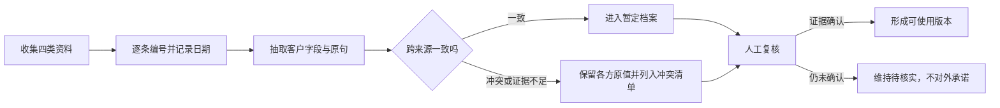

# 2026H2W11 作业：四类资料合成一份可信的客户档案

- 提交人：深圳华为财经-Denney
- GitHub：denney0808
- 任务日期：2026-09-14 至 2026-09-20
- 案例性质：**完全合成的流程演练**。没有使用真实客户资料，文中的“客户 A”和数值均为虚构，不代表提交人的实际客户或雇主。

## 1. 任务与资料范围

主仓库日历显示本周为 `2026H2W11`。主分支尚未发布独立的 W11 详细任务文件，我按半年度规划中的“标来源、识别冲突、人工核验”完成客户档案、冲突清单与核验记录。

为验证流程，我先构造了四类互相独立、带日期的模拟资料，并将每条事实绑定来源编号：

| 编号 | 模拟资料类型 | 日期 | 用于本次练习的原始记录摘要 |
| --- | --- | --- | --- |
| S1 | CRM 客户台账 | 2026-09-15 | 客户 A 为连锁零售企业；状态“已签约”；首批试点 20 家门店；预计 10 月 15 日上线；需求是缩短月度对账时间。 |
| S2 | 需求访谈纪要 | 2026-09-18 | 业务方提出首批试点 25 家门店、11 月 1 日上线；验收指标是对账耗时从 2 天降至半天；范围变更仍待审批。 |
| S3 | 合同草稿摘录 | 2026-09-10 | 草稿写首批试点 20 家门店；签章栏为空；生效条件为双方签署。没有提供后续正式签署版本。 |
| S4 | 实施问题单 | 2026-09-19 | 数据接口字段映射失败，严重级别为高；影响试点联调，尚未关闭。 |

这些是演练输入，不是外部权威证据。以下档案只能说明“如何处理有冲突的资料”，不能用于真实客户决策。

## 2. 客户档案（演练版）

| 字段 | 暂定内容 | 来源 | 可信状态 |
| --- | --- | --- | --- |
| 客户标识 | 客户 A（虚构连锁零售企业） | S1 | 仅供演练 |
| 核心需求 | 缩短月度对账时间 | S1、S2 | 两份模拟资料方向一致 |
| 衡量指标 | 对账耗时从 2 天降至半天 | S2 | 单一来源，待负责人确认口径与基线 |
| 首批试点范围 | 20 或 25 家门店 | S1、S2、S3 | **冲突，不能选填其中一个数字** |
| 合同状态 | CRM 标记“已签约”，但仅有未签署草稿 | S1、S3 | **未核实，不得写成正式签约** |
| 目标上线日 | 10 月 15 日或 11 月 1 日 | S1、S2 | **冲突；且受未关闭的联调问题影响** |
| 当前实施风险 | 接口字段映射失败，试点联调受阻 | S4 | 单一来源，需核对问题单最新状态 |

档案结论：需求方向可以作为沟通起点，但合同状态、试点范围和上线时间均未达到可对外承诺的证据标准。

## 3. 冲突清单与处理

| 冲突 | 证据 | 为什么不能直接合并 | 待核验动作 |
| --- | --- | --- | --- |
| C1：试点门店数 20 / 25 | S1、S3 / S2 | S2 明说变更待审批；新纪要不等于已批准合同范围 | 取得已签署合同、变更单或项目负责人的书面确认，再区分“合同范围”和“拟扩展范围” |
| C2：上线日 10 月 15 日 / 11 月 1 日 | S1 / S2 | 两份资料日期不同，且 S4 显示联调受阻；不能只取最新日期当承诺 | 核对获批项目计划、依赖项和联调恢复日期 |
| C3：已签约 / 仅见未签草稿 | S1 / S3 | S3 早于 S1，可能存在后续正式版本，但本次资料没有提供 | 索取签署版或合同系统状态；在此之前统一标“待核实” |

去重和冲突规则：同一事实按“字段 + 适用范围 + 生效日期”比较；较新的记录不自动覆盖较旧的合同依据；草稿、意向、已批准变更与已生效合同必须分层。若有冲突，保留两侧原值和出处，不让 AI 猜一个答案。

## 4. 核验记录

| 检查项 | 本次动作 | 结果 |
| --- | --- | --- |
| 来源完整性 | 为每个事实加 S1–S4 来源编号和资料日期 | 已完成 |
| 数字一致性 | 交叉比对试点门店数、上线日和合同状态 | 发现 C1–C3 三项冲突 |
| 依赖检查 | 将 S4 未关闭问题关联到上线风险 | 已标风险，未推定解决日期 |
| 人工核验 | 需要合同负责人、业务负责人和实施负责人确认对应字段 | **未执行；无真实客户和负责人可核验** |
| 对外使用门槛 | 合同状态、范围、时间任一未核实，不对外承诺 | 当前不满足 |

本次“核验记录”如实区分了 AI 已完成的资料交叉检查与尚未完成的真人授权确认；没有把机器检查冒充人工核验。

## 5. 可复用工作流

可复用提示词：

> 请把 CRM、访谈纪要、合同和实施问题单合成客户档案。每个字段必须带来源编号、资料日期和适用范围；遇到冲突保留原值，生成待核验清单，不按“最新优先”臆断。把已交叉验证、单一来源、冲突待核实、需人工批准四种状态分开。只有负责人确认且关键证据齐全后，才允许输出对外承诺版本。

## 6. 复盘与脱敏

最有用的是先把“原始记录、暂定判断、对外承诺”分成三层。这样既能快速看出客户需求，也不会让 CRM 字段或一次访谈自动变成合同事实。

人工最需要判断的是：哪一版合同生效、范围变更是否获批、上线日期是否能在实施风险下兑现。这些判断不能仅凭 AI 摘要完成。

本报告仅含虚构客户与模拟数值；没有真实客户名称、联系人、合同原文、内部系统截图、邮箱、密钥或本机路径。GitHub 只提交本脱敏报告，不上传原始资料或其他文件。
