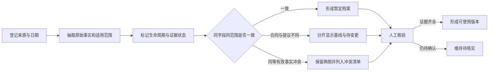

# 2026H2W12 作业：把客户档案流程封装为 Skill，并用客户 B 验证复用

- 提交人：深圳华为财经-Denney
- GitHub：denney0808
- 任务日期：2026-09-21 至 2026-09-27
- 数据说明：客户 B 及全部资料均为合成演练数据，不代表真实客户、雇主或业务项目。

## 1. 本周任务

今天是 2026-09-27，对应 `2026H2W12`。主分支尚未发布独立详细任务文件，因此我按半年度规划完成：把上周“多来源客户档案”流程封装为 Skill，使用不同的客户 B 在独立验证会话中测试复用，并根据测试结果修订。

## 2. Skill 产出

我创建了 `customer-profile-evidence-builder`，本地结构为：

```text
customer-profile-evidence-builder/
├── SKILL.md
└── agents/
    └── openai.yaml
```

Skill 面向 CRM 记录、访谈或会议纪要、合同资料和实施记录的合并任务，要求输出：

1. 来源登记表；
2. 带来源和证据状态的客户档案；
3. 冲突或待变更清单；
4. 区分机器检查与人工确认的核验记录；
5. 限制与脱敏说明。

核心规则是：每个重要事实必须有来源编号；原始值和规范化值分开；较新的纪要不能自动覆盖合同；冲突要保留两侧证据；未知信息不能由 AI 补写。

## 3. 客户 B 独立验证

验证使用四份与客户 A 无关的合成资料：

| 来源 | 类型 | 关键内容 |
| --- | --- | --- |
| S1 | CRM 记录 | 试点已批准，第一阶段 8 个工厂 |
| S2 | 工作坊纪要 | 提议扩至 10 个工厂，期望提前启动并提高指标 |
| S3 | 已签署合同摘要 | 8 个工厂，2026-12-01 启动，库存差异率不高于 2.0% |
| S4 | 实施问题单 | 两个工厂存在主数据编码问题，状态处理中 |

独立验证会话只获得 Skill 和客户 B 原始资料，没有获得客户 A 的答案或预期结论。验证结果正确区分了合同基线和待批准提议：

| 字段 | 合同或当前基线 | 待批准提议 | 结果 |
| --- | --- | --- | --- |
| 第一阶段范围 | 8 个工厂（S3；S1 一致） | 10 个工厂（S2） | 提议未覆盖合同 |
| 启动日期 | 2026-12-01（S3） | 2026-11-20（S2） | 期望日期未成为承诺 |
| 验收指标 | 库存差异率不高于 2.0%（S3） | 不高于 1.5%（S2） | 新指标标为待批准 |
| 实施问题 | S4 记录“处理中” | 无解决日期 | 未补写关闭时间或工厂身份 |

验证者将单条 CRM 和问题单保守标为“单一来源”，没有把业务愿望、严重级别或未知责任人扩写成确定事实。

## 4. 验证发现与修订

第一次版本能够保留来源和冲突，但独立测试发现五项规则仍需明确：

1. 证据权威性必须按具体字段判断，不能给所有资料统一排位。
2. 资料日期和事实生效日期必须分别记录，不能相互替代。
3. 已签约基线与未批准提议不同，应列为“待变更”，而不是两个同等事实的冲突。
4. 资料没有责任人时，应写“待指定责任角色”，不能猜姓名或组织。
5. 问题严重级别为高，不代表项目必然阻断，除非来源或获授权人员明确说明。

我把这些规则补进 Skill，并增加 `not applicable` 生命周期，避免把客户类型等描述性字段硬塞进“提议、批准、签约、执行”四档。

## 5. 验证结果

- Skill 结构验证：通过。
- Frontmatter 名称和描述：通过。
- UI 元数据：通过；发现 Windows 中文参数乱码后改用清晰英文显示名称重新生成。
- 未完成占位符扫描：未发现 `TODO` 或 `PLACEHOLDER`。
- 客户 B 复用：重要结论均有 S1–S4 来源；合同基线、提议和运营状态成功分层。
- 人工核验边界：审批文件、问题复测、责任人和未提供的生效日期仍保持待核实。

## 6. 可复用工作流



## 7. 复盘与脱敏

最有价值的改进不是增加更多输出，而是把“资料新旧”和“证据效力”分开。工作坊纪要可能比合同更新，但在变更获批前仍不能覆盖合同基线。

本次客户 B、工厂数量、日期、指标和问题均为虚构；没有真实客户名称、联系人、合同原文、内部系统信息、邮箱、凭据或本机路径。Skill、测试资料和验证记录仅保存在本地，GitHub 只提交本脱敏报告。
